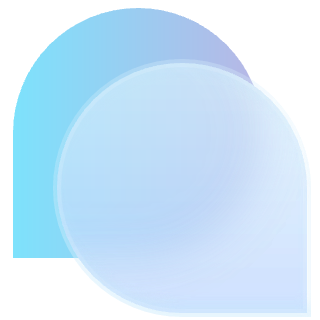

# Matcha-Adapter

  

基于 NapCat 适配器魔改而来的 [Matcha](https://github.com/A-kirami/matcha) 适配器。

---

## 简介

Matcha-Adapter 是基于 [NapCat适配器](https://github.com/UnCLAS-Prommer/MaiBot-Napcat-Adapter) 魔改的机器人适配器，专为沙盒环境WebUI而生。

- **高性能**：优化消息收发与事件处理，适合大规模群聊环境。
- **易扩展**：模块化设计，便于二次开发和功能拓展。
- **丰富日志**：支持彩色日志输出，便于调试和运维。

---

## 主要特性

- 支持多种消息事件处理
- 断线自动重连与消息池机制
- 配置灵活，支持热更新
- 详细的日志与错误追踪

---

## 鸣谢

本项目基于 NapCat-Adapter 进行魔改，感谢原作者的开源贡献。

---
